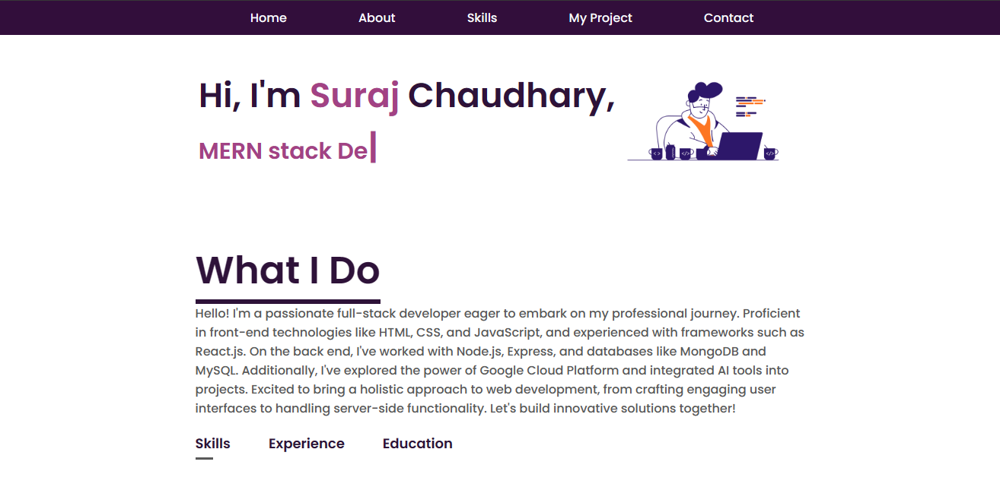
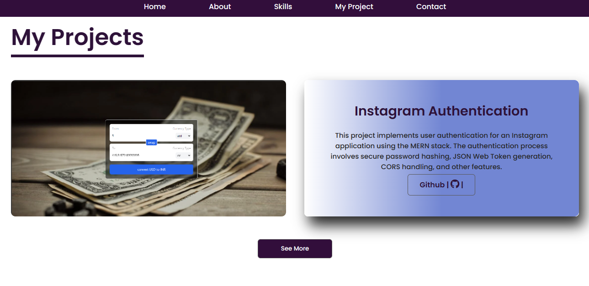
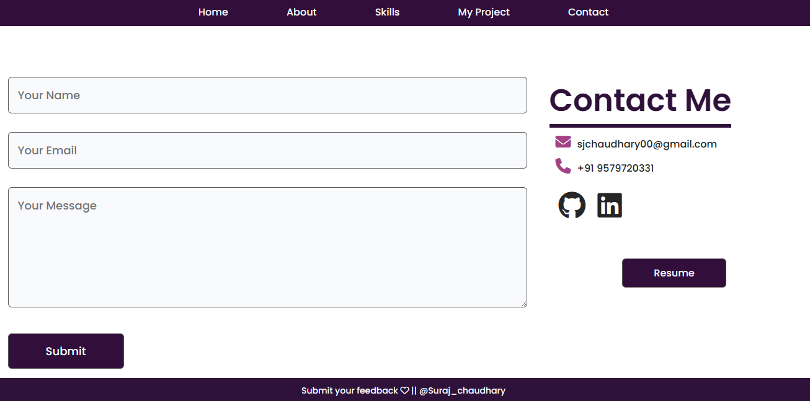

# Suraj Chaudhary Portfolio: 
Hi.. Welcome ! 

Showcasing Exceptional Web Development Skills

Welcome to my impressive portfolio, where I showcase my expertise in web development using HTML, CSS, and JavaScript. As a highly skilled and passionate web developer, I strive to deliver exceptional digital experiences that captivate users and drive results. Let's dive into my projects and achievements that highlight my capabilities and make me an excellent candidate for your consideration.

About Me:

 Driven by Creativity and Technical Excellence
I am a dynamic and innovative web developer with a deep passion for crafting visually stunning and user-friendly websites. Equipped with strong problem-solving skills and a creative mindset, I consistently deliver projects that surpass expectations. With a keen eye for design, attention to detail, and a solid understanding of user experience principles, I am dedicated to building intuitive and engaging web solutions.

Projects: Showcasing Technical Proficiency and Results-Oriented Approach

* Hosted Link : http://127.0.0.1:59283/My-Portfolio/index.html

___________________________________
## website Screenshots

___________________________________

### Project 1: Currency Converter

Description:  A swift and intuitive currency converter built using Vite, React, and TailwindCSS. Whether you're traveling, doing business internationally get accurate conversion rates at your fingertips. Utilizes a real-time currency data.

Technologies Used: HTML, CSS, JavaScript , React.js, API

Demo: https://curr-convertorr.netlify.app/

Key Achievements: Utilizes a real-time currency data.

### Project 2: Instagram Authentication

Description: This project implements user authentication for an Instagram application using the MERN stack. The authentication process involves secure password hashing, JSON Web Token generation, CORS handling, and other features.

Technologies Used: HTML, CSS, JavaScript, Node.js , Mongodb, Express , React.js

Key Achievements:  The authentication process involves secure password hashing, JSON Web Token generation, CORS handling, and other features.

Demo: [link will Update soon]

### Project 3: Beats Headphone

Description:  This is small mini-projects which i build useing HTML,CSS and
                javascript. You can check by pressing the live button

Technologies Used: HTML, CSS, JavaScript.

Key Achievements: Impressive Web Design. 

Demo: https://cksuraj.github.io/Beats-Headphons/

GitHub Repository: 

In-Depth Look at Code and Technical Expertise
To gain deeper insights into my technical skills and coding abilities, I invite you to explore my GitHub repository. It hosts a comprehensive collection of my projects, including the source code, commit history, and any additional assets used. By reviewing my code, you will witness my attention to detail, best coding practices, and ability to write clean, maintainable, and scalable code.

Visit my GitHub repository to access the wealth of information and get a closer look at my coding prowess.

Contact Me: Let's Collaborate and Create Exceptional Web Experiences

Thank you for visiting my portfolio. I am excited about the opportunity to contribute my skills and expertise to your esteemed organization. If you would like to discuss potential collaboration, have any inquiries, or require further information, please feel free to reach out to me. You can contact me via email at sjchaudhary00@gmail.com or connect with me on my LinkedIn profile https://www.linkedin.com/in/suraj-chaudhary-4406401b4/

## Contributing

Contributions are always welcome!

## 🛠 Skills
Javascript, HTML, CSS , Bootstrap

